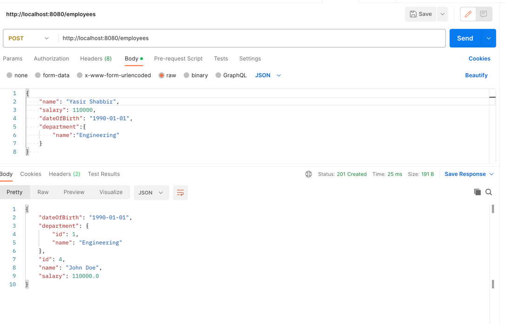
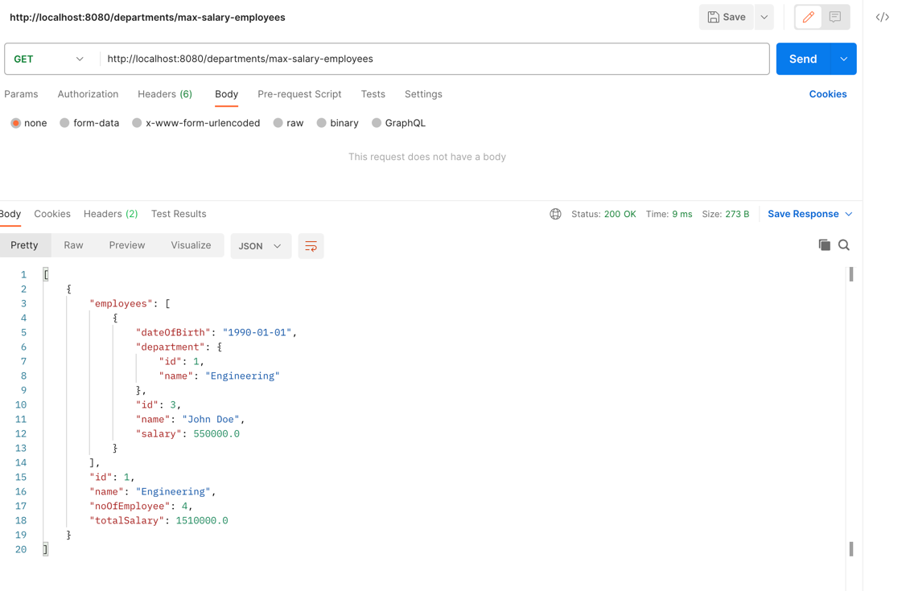

# Employee-Department Application

The Employee-Department application is a sample application built with Quarkus and Java. It provides RESTful APIs to manage employees and departments.

## Requirements

- Java Development Kit (JDK) 11 or higher
- Apache Maven
- PostgreSQL database (or any other supported database)
- cURL or an API testing tool (e.g., Postman)

## Technologies Used

- Quarkus - A Kubernetes Native Java framework
- Java - Programming language
- JPA (Java Persistence API) - Standard for ORM (Object-Relational Mapping)
- H2 - In memory Relational database

## Getting Started

1. Clone the repository:

   ```bash
   git clone https://github.com/yasirshabbir44/employee-department-using-quarkus.git


## Running the application in dev mode

You can run your application in dev mode that enables live coding using:
```shell script
./mvnw compile quarkus:dev
```

> **_NOTE:_**  Quarkus now ships with a Dev UI, which is available in dev mode only at http://localhost:8080/q/dev/.

## Packaging and running the application

The application can be packaged using:
```shell script
./mvnw package
```
It produces the `quarkus-run.jar` file in the `target/quarkus-app/` directory.
Be aware that it’s not an _über-jar_ as the dependencies are copied into the `target/quarkus-app/lib/` directory.

The application is now runnable using `java -jar target/quarkus-app/quarkus-run.jar`.

You can then execute your native executable with: `./target/yasir-assignment-1.0.0-SNAPSHOT-runner`


## Endpoints
The following RESTful endpoints are available:

#### Department

* GET /api/departments - Retrieve a list of all departments. 
* GET /api/departments/{id} - Retrieve a specific department by ID. 
* POST /api/departments - Create a new department. 
* PUT /api/departments/{id} - Update an existing department. 
* DELETE /api/departments/{id} - Delete a department.


#### Employee
* GET /api/employees - Retrieve a list of all employees. 
* GET /api/employees/{id} - Retrieve a specific employee by ID. 
* POST /api/employees - Create a new employee. 
* PUT /api/employees/{id} - Update an existing employee. 
* DELETE /api/employees/{id} - Delete an employee.

### Postman Sample call
* Create Department

  `curl -X POST -H "Content-Type: application/json" -d '{
  "name": "Sales"
  }' http://localhost:8080/department
  `


* Create an Employee and Create new department or associate with existing one

  `curl --location 'http://localhost:8080/employees' \
  --header 'Content-Type: application/json' \
  --data '{
  "name": "Yasir Shabbir",
  "salary": 110000,
  "dateOfBirth": "1990-01-01",
  "department":{
  "name":"Engineering"
  }
  }   '`
  


* Get the department with maximum salary along with Employee list

  `curl --location 'http://localhost:8080/departments/max-salary-employees'`
  